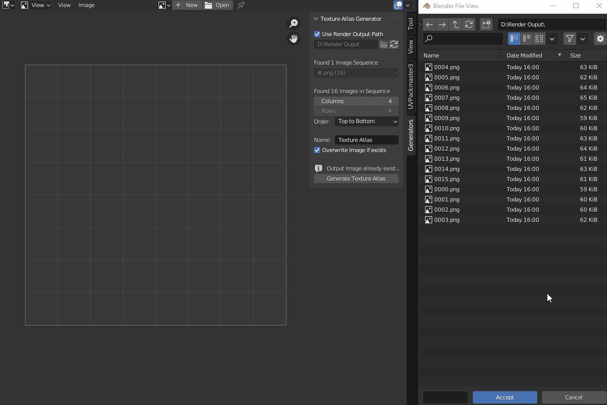

# Blender Add-on: Texture Atlas Generator
Allows generation of Texture Atlas Images / Tilemaps from image sequences.

## Features
### Generate Texture Atlas (Image Editor > Generators > Texture Atlas Generator)
Choose a folder to automatically scan for image sequences, then choose an image sequence.
Configure tiling and vertical order, specify output name and generate a new texture atlas from the image sequence based on the configured options.
The texture atlas will be stored as a new image data block.

## Changelog:
### v1.0 (03.09.2022)
* Initial release

## Feel free to leave feedback and suggestions!
If this helped you out in any way, shape or form, feel free to let me know!
That's why I created this add-on in the end.